# 🕸️ Nexus — Smart AI Scraper

**Nexus** is a scalable, containerized web intelligence pipeline designed to transform unstructured web traffic into structured, analyzable data. It combines an **active discovery crawler** with a **self-healing AI analysis layer**, allowing ingestion and enrichment to continue even when APIs fail, rate limits are hit, or sitemaps are unavailable.

The project is built for resilience, observability, and controlled automation rather than blind scraping.


---

## 🚀 Key Features

### 1. 🧠 Self-Healing AI “Waterfall”

Nexus does not depend on a single AI provider. Content analysis is performed through a **priority-based fallback chain**. When a provider fails (HTTP 5xx), throttles (429), or becomes unavailable, the system automatically switches to the next option without interrupting the pipeline.

Current priority order:

1. **AvalAI** — Primary (high throughput, low latency)
2. **Cloudflare Workers AI** — Secondary (cost-efficient)
3. **Cohere** — Fallback (large context handling)
4. **OpenRouter** — Aggregated routing layer
5. **Ollama** — Local fallback (offline / privacy-focused)

This design favors continuity and controlled degradation over optimal-but-fragile performance.

---

### 2. 🕷️ Smart Discovery Engine (Automatic Fallback)

Nexus operates as an **active crawler**, not a sitemap-dependent scraper.

* **Strategy A — Passive Discovery**
  Parses `robots.txt` and `sitemap.xml` to identify valid, recent content with minimal overhead.

* **Strategy B — Active BFS Crawl**
  If sitemaps are missing, incomplete, or intentionally empty, Nexus switches to a **recursive breadth-first crawl**.
  The crawler:

  * Differentiates navigation pages from content pages
  * Follows internal link structures selectively
  * Filters out advertisements, tag pages, and low-signal URLs

The goal is controlled discovery, not maximum page coverage.

---

### 3. ⚡ High-Performance, Observable Architecture

* **Concurrent Ingestion:**
  Gevent-based workers handling dozens of simultaneous connections without blocking.

* **Compliance-First Crawling:**
  Strict `robots.txt` enforcement and configurable crawl delays.

* **Operational Visibility:**
  A Streamlit dashboard provides:

  * Live crawl status
  * Queue depth monitoring
  * Manual triggers and overrides
  * Visual inspection of extracted content

The system is designed to be inspected, not treated as a black box.

---

## 🏗️ Architecture Overview

```mermaid
graph TD
    User([User]) -->|Control| Dash[Streamlit Dashboard]
    
    subgraph "Ingestion Engine"
        Dash -->|1. Trigger| Redis[(Redis Queue)]
        Redis -->|Queue: Default| Discovery[🕷️ Discovery Worker]
        Discovery -->|A. Sitemap| Net((Internet))
        Discovery -->|B. BFS Crawl| Net
        Discovery -->|Found URLs| Redis
        Redis -->|Queue: Default| Scraper[⚡ Scraper Worker]
        Scraper -->|Extract HTML| DB[(PostgreSQL)]
    end

    subgraph "Intelligence Engine"
        Scraper -->|Chain Task| Redis
        Redis -->|Queue: AI| Enricher[🧠 AI Worker]
        
        Enricher -->|Attempt 1| AvalAI[AvalAI API]
        AvalAI -.->|Fail / 429| CF[Cloudflare AI]
        CF -.->|Fail| Cohere[Cohere API]
        Cohere -.->|Fail| Local[Ollama Local]
        
        Enricher -->|Persist Tags & Summaries| DB
    end
```


## 🛠️ Quick Start

### Prerequisites
*   Docker & Docker Compose installed.
*   API Keys for at least one provider (AvalAI, Cloudflare, OpenRouter, etc.).

### 1. Clone & Setup
```bash
git clone https://github.com/abtn/nexus-smart-scraper.git
cd nexus-smart-scraper
touch .env
```

### 2. Configure Environment (.env)
Paste the following into your `.env` file. You only need to fill in the keys you plan to use.

```ini
# --- INFRASTRUCTURE ---
POSTGRES_USER=admin
POSTGRES_PASSWORD=adminpass
POSTGRES_DB=scraper_db
POSTGRES_HOST=postgres
POSTGRES_PORT=5432
REDIS_URL=redis://redis:6379/0

# --- AI WATERFALL CONFIGURATION ---
# The system tries these in order. 

# 1. AvalAI (Primary)
AVALAI_API_KEY=your_avalai_key
AVALAI_MODEL=gemma-3n-e2b-it

# 2. Cloudflare (Secondary)
CF_ACCOUNT_ID=your_cf_id
CF_API_TOKEN=your_cf_token
CF_MODEL=@cf/meta/llama-3-8b-instruct

# 3. Cohere (Tertiary)
COHERE_API_KEY=your_cohere_key

# 4. OpenRouter (Quaternary)
OPENROUTER_API_KEY=your_openrouter_key

# 5. Local Ollama (Final Fallback)
AI_BASE_URL=http://ollama:11434
AI_MODEL=phi3.5
```

### 3. Launch
```bash
docker compose up --build -d
```
*Access the Dashboard at `http://localhost:8501`*

### 4. Initialize Database
```bash
docker exec scraper_api alembic upgrade head
```

---

## 🖥️ Using the Dashboard

### 1. Smart Crawler
*   Navigate to the **"Smart Crawler"** section in the sidebar.
*   **Discovery Strategy:**
    *   **Auto:** Tries sitemaps first. If that fails, it automatically switches to the Recursive Crawler.
    *   **Force Recursive Crawl:** Ignores sitemaps and immediately starts spidering the site (depth 2).
*   **Status:** Watch the logs in your terminal or the "Pipeline Status" metrics in the UI.

### 2. Visual Feed
*   Processed articles appear as cards with:
    *   **Urgency Score** (1-10)
    *   **AI Category**
    *   **AI Summary** & **Tags**
*   "Pending" or "Processing" items are shown in blue/gray until the AI finishes.

### Running Tests
```bash
docker exec scraper_api pytest tests/ -v
```

### Resetting Data
To clear the database but keep the config:
```bash
docker exec -i scraper_postgres psql -U admin -d scraper_db -c "TRUNCATE TABLE scraped_data, logs, sources RESTART IDENTITY CASCADE;"
```
---

## 🎯 Design Philosophy

* Prefer **resilience over elegance**
* Prefer **controlled automation over aggressive scraping**
* Assume **external services will fail**
* Make every critical subsystem observable and replaceable

Nexus is intended as a foundation for long-running, production-grade web intelligence workflows—not a disposable scraping script.
