# 🕸️ Nexus — Smart AI Scraper

**Nexus** is a scalable, containerized web intelligence pipeline designed to transform unstructured web traffic into structured, analyzable data. It combines an **active discovery crawler** with a **self-healing AI analysis layer**, allowing ingestion and enrichment to continue even when APIs fail, rate limits are hit, or sitemaps are unavailable.

The project is built for resilience, observability, and controlled automation rather than blind scraping.

---

## 🚀 Key Features

### 1. 🧠 Self-Healing AI “Waterfall”

Nexus does not depend on a single AI provider. Content analysis is performed through a **priority-based fallback chain**. When a provider fails (HTTP 5xx), throttles (429), or becomes unavailable, the system automatically switches to the next option without interrupting the pipeline.

Current priority order:

1. **AvalAI** — Primary (high throughput, low latency)
2. **Cloudflare Workers AI** — Secondary (cost-efficient)
3. **Cohere** — Fallback (large context handling)
4. **OpenRouter** — Aggregated routing layer
5. **Ollama** — Local fallback (offline / privacy-focused)

This design favors continuity and controlled degradation over optimal-but-fragile performance.

---

### 2. 🕷️ Smart Discovery Engine (Automatic Fallback)

Nexus operates as an **active crawler**, not a sitemap-dependent scraper.

* **Strategy A — Passive Discovery**
  Parses `robots.txt` and `sitemap.xml` to identify valid, recent content with minimal overhead.

* **Strategy B — Active BFS Crawl**
  If sitemaps are missing, incomplete, or intentionally empty, Nexus switches to a **recursive breadth-first crawl**.
  The crawler:

  * Differentiates navigation pages from content pages
  * Follows internal link structures selectively
  * Filters out advertisements, tag pages, and low-signal URLs

The goal is controlled discovery, not maximum page coverage.

---

### 3. ⚡ High-Performance, Observable Architecture

* **Concurrent Ingestion:**
  Gevent-based workers handling dozens of simultaneous connections without blocking.

* **Compliance-First Crawling:**
  Strict `robots.txt` enforcement and configurable crawl delays.

* **Operational Visibility:**
  A Streamlit dashboard provides:

  * Live crawl status
  * Queue depth monitoring
  * Manual triggers and overrides
  * Visual inspection of extracted content

The system is designed to be inspected, not treated as a black box.

---

## 🏗️ Architecture Overview

```mermaid
graph TD
    User([User]) -->|Control| Dash[Streamlit Dashboard]
    
    subgraph "Ingestion Engine"
        Dash -->|1. Trigger| Redis[(Redis Queue)]
        Redis -->|Queue: Default| Discovery[🕷️ Discovery Worker]
        Discovery -->|A. Sitemap| Net((Internet))
        Discovery -->|B. BFS Crawl| Net
        Discovery -->|Found URLs| Redis
        Redis -->|Queue: Default| Scraper[⚡ Scraper Worker]
        Scraper -->|Extract HTML| DB[(PostgreSQL)]
    end

    subgraph "Intelligence Engine"
        Scraper -->|Chain Task| Redis
        Redis -->|Queue: AI| Enricher[🧠 AI Worker]
        
        Enricher -->|Attempt 1| AvalAI[AvalAI API]
        AvalAI -.->|Fail / 429| CF[Cloudflare AI]
        CF -.->|Fail| Cohere[Cohere API]
        Cohere -.->|Fail| Local[Ollama Local]
        
        Enricher -->|Persist Tags & Summaries| DB
    end
```

---

## 🎯 Design Philosophy

* Prefer **resilience over elegance**
* Prefer **controlled automation over aggressive scraping**
* Assume **external services will fail**
* Make every critical subsystem observable and replaceable

Nexus is intended as a foundation for long-running, production-grade web intelligence workflows—not a disposable scraping script.
