# 🕸️ Nexus — Autonomous Adaptive Intelligence Node

**Nexus** is not just a scraper; it is a self-evolving **Agentic RAG** system. It bridges the gap between static databases and the dynamic web.

Unlike traditional RAG systems that fail when they lack data, Nexus detects knowledge gaps, autonomously **hunts** for new information, ingests it in real-time, and **learns** from the process by adding high-value sources to its permanent monitoring schedule.


---

## 🧠 The 4 Phases of Intelligence

Nexus operates on a four-stage cognitive architecture:

### 1. 💾 Memory (Semantic Recall)
*   **Tech:** PostgreSQL + `pgvector` + `nomic-embed-text`.
*   **Function:** Stores scraped articles not just as text, but as **vector embeddings**.
*   **Benefit:** Allows the system to recall information based on *meaning* and concepts, not just keyword matches.

### 2. 👀 Eyes (The Hunter)
*   **Tech:** Tavily API (Primary) with DuckDuckGo Fallback.
*   **Function:** When the system realizes it doesn't know an answer, it searches the live web.
*   **Resilience:** Automatically filters out noise (YouTube, PDFs, Ads) and handles `robots.txt` compliance and network fragmentation (MTU issues).

### 3. 🤖 Brain (The Orchestrator)
*   **Tech:** Custom Agentic Workflow (Audit $\to$ Gap-Fill $\to$ Synthesis).
*   **Function:**
    1.  **Audit:** Checks local DB. *"Do I know enough about Nuclear Fusion?"*
    2.  **Gap-Fill:** If NO, triggers the Hunter and Scraper to fetch new data in real-time.
    3.  **Synthesis:** Uses the AI Waterfall (AvalAI -> Cloudflare -> Ollama) to write a cited answer.

### 4. 🧬 Evolution (Self-Learning)
*   **Tech:** Adaptive Scheduler.
*   **Function:** If the Agent finds a new, useful website during a search, it **promotes** that domain.
*   **Result:** One-off research turns into a permanent, automated monitoring job. The system builds its own knowledge base.

---

## 🏗️ Architecture Overview

```mermaid
graph TD
    User([User]) -->|Question| API[FastAPI / Orchestrator]
    
    subgraph "Phase 1: Memory"
        API -->|Semantic Search| DB[(Postgres + Vector)]
        DB -->|Context| API
    end

    subgraph "Phase 2 & 3: Eyes & Brain"
        API -->|Decision: Need Info?| Hunter[👀 Hunter Module]
        Hunter -->|Search Web| Tavily[Tavily / DDG]
        Tavily -->|New URLs| Scraper[⚡ Scraper Worker]
        Scraper -->|Extract & Embed| DB
    end

    subgraph "Phase 4: Evolution"
        API -->|Good Source Found?| Scheduler[📅 Scheduler]
        Scheduler -->|Create Job| DB
    end

    subgraph "AI Waterfall"
        Enricher[🧠 AI Worker] -->|Reasoning| AvalAI
        AvalAI -.->|Failover| Cloudflare
        Cloudflare -.->|Failover| LocalOllama
    end
```



---

## 🛠️ Quick Start

### Prerequisites
*   Docker & Docker Compose installed.
*   (Optional but Recommended) API Keys for **Tavily** (Search) and **AvalAI/Cloudflare** (Reasoning).

### 1. Clone & Setup
```bash
git clone https://github.com/abtn/nexus-smart-scraper.git
cd nexus-smart-scraper
touch .env
```

### 2. Configure Environment (.env)
Nexus uses a "Waterfall" strategy. It tries the best API first, then falls back to cheaper/local options.

```ini
# --- INFRASTRUCTURE ---
POSTGRES_USER=admin
POSTGRES_PASSWORD=adminpass
POSTGRES_DB=scraper_db
POSTGRES_HOST=postgres
POSTGRES_PORT=5432
REDIS_URL=redis://redis:6379/0

# --- SEARCH (The Eyes) ---
# Get a free key at https://tavily.com (Recommended for best results)
TAVILY_API_KEY=tvly-xxxxxxxxxxxx

# --- AI REASONING (The Brain) ---
# 1. AvalAI (Primary - High Speed/Quality)
AVALAI_API_KEY=your_avalai_key
AVALAI_MODEL=gemma-3n-e2b-it

# 2. Cloudflare (Secondary - Cheap)
CF_ACCOUNT_ID=your_cf_id
CF_API_TOKEN=your_cf_token
CF_MODEL=@cf/meta/llama-3-8b-instruct

# 3. Local Ollama (Fallback - Slow but Private)
AI_BASE_URL=http://ollama:11434
AI_MODEL=phi3.5
# Embedding Model (Required for Memory)
EMBEDDING_MODEL=nomic-embed-text
```

### 3. Launch
```bash
# Build with no cache to ensure fresh dependencies
docker compose build --no-cache
docker compose up -d
```
*Access the Dashboard at `http://localhost:8501`*

### 4. Initialize Database
Since we use `pgvector`, we need to run migrations to enable the extension and create tables.
```bash
docker exec scraper_api alembic upgrade head
```

---

## 🖥️ Using Nexus

### 🤖 1. Agent Chat (The Brain)
*   Navigate to the **"🤖 Agent Chat"** tab.
*   **Ask a question:** e.g., *"What are the latest breakthroughs in 6G technology?"*
*   **Watch it think:**
    1.  It checks its database.
    2.  If empty, it hunts the web (Tavily/DDG).
    3.  It scrapes the new links in the background.
    4.  It writes a sourced answer.
    5.  **Evolution:** Check the "Active Monitors" sidebar afterwards. You will see it automatically added the new sites to be monitored daily!

### 📡 2. Smart Crawler (Manual)
*   Sidebar: **"Add New Source"**
*   Paste a URL (RSS feed, Homepage, or Article).
*   Nexus auto-detects the type and sets up the appropriate crawler strategy (Sitemap vs Recursive).

### 🔥 3. Live Feed
*   View processed intelligence cards with **Urgency Scores**, **Summaries**, and **AI Tags**.

---

## 🔧 Troubleshooting

*   **Search Errors (SSL/Timeout):**
    *   If you are on WSL2, we have set the Docker MTU to 1350 in `docker-compose.yml` to prevent packet fragmentation. If issues persist, ensure your VPN is off or compatible.
*   **"Empty Response" from Agent:**
    *   Ensure your `TAVILY_API_KEY` is set.
    *   If using Local Ollama, ensure your GPU has enough VRAM (4GB+) to run both the Chat Model (`phi3.5`) and Embedding Model (`nomic-embed`) simultaneously. If not, use a Cloud API key (AvalAI/Cloudflare).

## 🎯 Design Philosophy

*   **Adaptive:** The system should change its behavior based on what it finds.
*   **Resilient:** If one API fails, try the next. If the network blips, retry.
*   **Autonomous:** Don't wait for the human to add sources. Find them.
